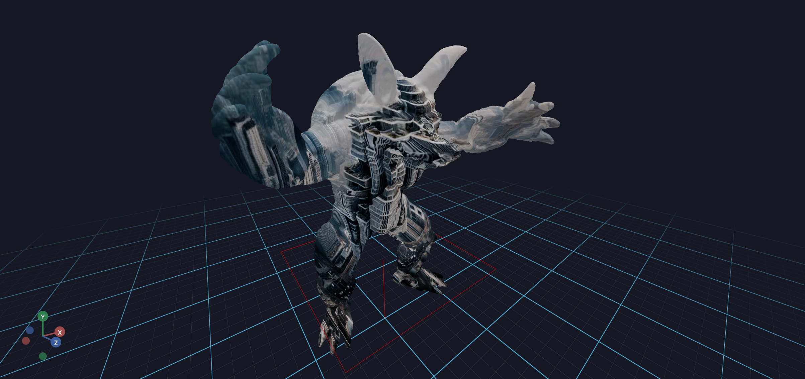

# Textured Trimesh

This example shows you how to load mesh files in various ways, and how to update the mesh in real-time.



```python
from asyncio import sleep
from pathlib import Path

import numpy as np
import trimesh

from vuer import Vuer
from vuer.events import Set
from vuer.schemas import Obj, DefaultScene, TriMesh, SceneBackground

assets_folder = Path(__file__).parent / "../../../../assets"
test_file = "static_3d/armadillo_midres.obj"

mesh = trimesh.load_mesh(assets_folder / test_file)
assert isinstance(mesh, trimesh.Trimesh)
mesh.apply_scale(1)

# from trimesh import util
with open(assets_folder / test_file, "rb") as f:
    data = f.read()
    text = trimesh.util.decode_text(data)

app = Vuer(static_root=assets_folder)

print(f"Loaded mesh with {mesh.vertices.shape} vertices and {mesh.faces.shape} faces")
xyz = np.array(mesh.vertices)
uv = xyz[:, :2]  # take the x, y coordinates
uv -= uv.min(axis=0)  # normalize the uv coordinates to 0 - 1
uv /= uv.max(axis=0)


# use `start=True` to start the app immediately
@app.spawn(start=True)
async def main(session):
    session @ Set(
        DefaultScene(
            SceneBackground(),
            TriMesh(
                key="trimesh",
                vertices=np.array(mesh.vertices),
                faces=np.array(mesh.faces),
                uv=uv,
                position=[0, 1.7, 0],
                materialType="phong",
                material=dict(
                    map="http://localhost:8012/static/images/marigold/dalle3/dalle3_rgb.jpg",
                    # mapRepeat=[2, 4],
                ),
            ),
            up=[0, 1, 0],
        ),
    )

    while True:
        await sleep(0.016)
```

Now, by passing in a repeat parameter, you can repeat the texture on the mesh.

add `mapRepeat=[2, 4]` to the `material` dict to repeat the texture map:

```python
TriMesh(
    key="trimesh",
    ...
    uv=uv,
    material=dict(
        map="http://localhost:8012/static/images/marigold/dalle3/dalle3_rgb.jpg",
        mapRepeat=[2, 4],
    ),
),
```
