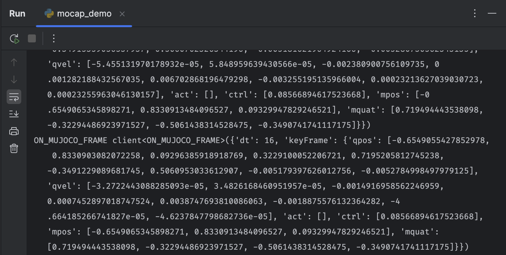

# MuJoCo VR Mocap Example

First, let's import the dependencies.

```python
from asyncio import sleep
from textwrap import dedent

from killport import kill_ports
from vuer import Vuer, VuerSession
from vuer.events import ClientEvent
from vuer.schemas import MuJoCo, Scene, Fog, Sphere, Hands, HandActuator
```


We need to list all of the required files. This needs to be done
manually upfront because I don't want to add an additional step
of first parsing these assets from the mjcf file.

```python
ASSETS_LIST = (
    dedent("""
    franka_gripper.xml
    assets/finger_0.obj
    assets/finger_1.obj
    assets/hand.stl
    assets/hand_0.obj
    assets/hand_1.obj
    assets/hand_2.obj
    assets/hand_3.obj
    assets/hand_4.obj
    assets/bin.xml
    assets/table.xml
    """)
    .strip()
    .split("\n")
)
```


Now you can instantiate the vuer server:

```python
kill_ports(ports=[8012])
app = Vuer()
```


```{admonition} Note
:class: tip
You need to install `ngrok` to promote the local vuer server
from ws://localhost:8012 to wss://xxxx.ngrok.io, (note the double
w[ss] in the protocol), and pass it as a query parameter that
looks like this:

      https://vuer.ai?ws=wss://xxxxx.ngrok.io

You also need to load from the correct host.    
```

```python
# this won't work because it does not have SSL.
asset_pref = f"https://docs.vuer.ai/en/latest/_static/mujoco_scenes/gripper_model/"
```


Now, to get the mujoco updates, we can listen to the `ON_MUJOCO_FRAME` event.

```python
@app.add_handler("ON_MUJOCO_FRAME")
async def on_mujoco_frame(event: ClientEvent, sess: VuerSession):
    print("ON_MUJOCO_FRAME", event)
```

You should get events that looks like these:



and the main session handler.

```python
@app.spawn(start=True)
async def main(sess: VuerSession):
    # here we setup the staging area. Use Fog to simulate MuJoCo's
    # default style.
    sess.set @ Scene(
        # grid=False,
        bgChildren=[
            Fog(color=0x2C3F57, near=10, far=20),
            Hands(),
            Sphere(
                args=[50, 10, 10],
                materialType="basic",
                material=dict(color=0x2C3F57, side=1),
            ),
        ],
    )
    await sleep(0.0005)
    sess.upsert @ MuJoCo(

        HandActuator(key="pinch-on-squeeze"),

        key="franka-gripper",
        src=asset_pref + "scene.xml",
        assets=[asset_pref + fn for fn in ASSETS_LIST],
        useLights=True,
        timeout=1000000,
        scale=0.1,
    )

    await sleep(100.0)
```


```{admonition} Note
:class: tip

Note the `HandActuator` that is used to add control to the
gripper fingers. This is currently hand-specific.

    class HandActuator(SceneElement):
        tag = "HandActuator"

        ctrlId = -1
        offset = 0.01
        low = 0.01
        high = 1.0
        cond = 'right-squeeze'
        value = "right:thumb-tip,right:index-finger-tip"
        scale = 1.0
```

This correspond to the following actuator definition
in the MJCF file:

```xml
...
      <body name="right_finger" pos="0 0 0.0584" quat="0 0 0 1">
        <inertial mass="0.015" pos="0 0 0" diaginertia="2.375e-6 2.375e-6 7.5e-7"/>
        <joint name="finger_joint2" class="finger"/>
        <geom mesh="finger_0" material="off_white" class="visual"/>

...
    <!-- Remap original ctrlrange (0, 0.04) to (0, 255): 0.04 * 100 / 255 = 0.01568627451 -->
    <position ctrllimited="true" ctrlrange="0.001 0.2" joint="finger_joint1" kp="30"
              gear="3" name="finger_joint"/>
  </actuator>
</mujoco>
```
